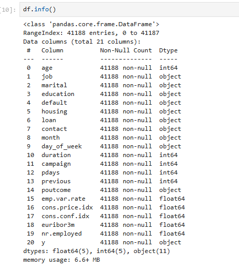
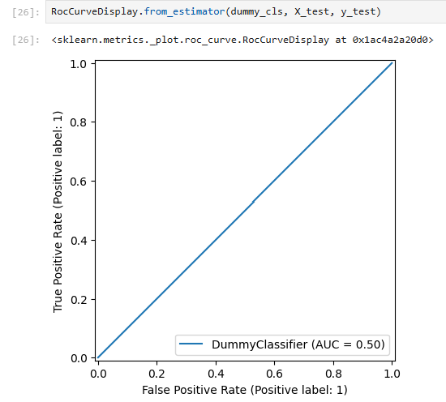
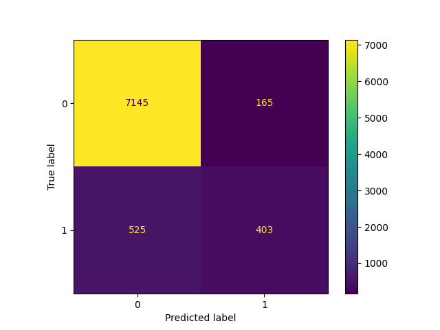
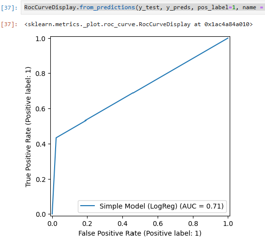
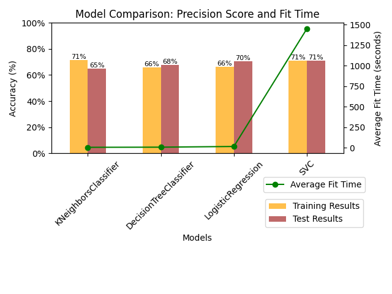
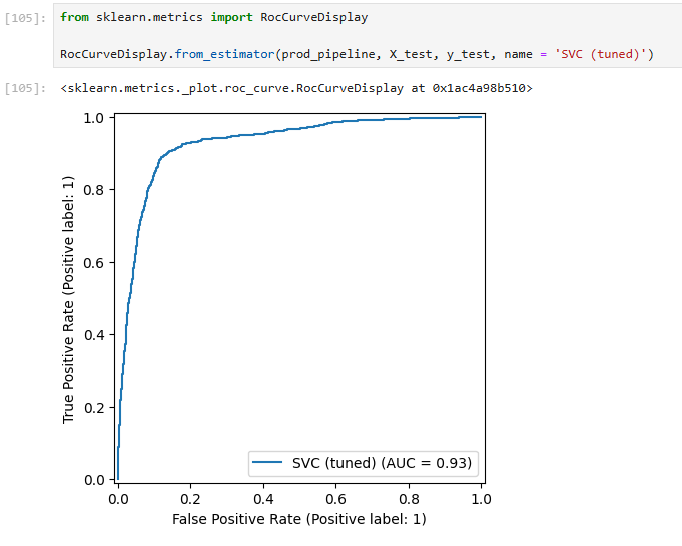
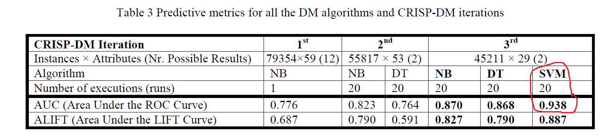
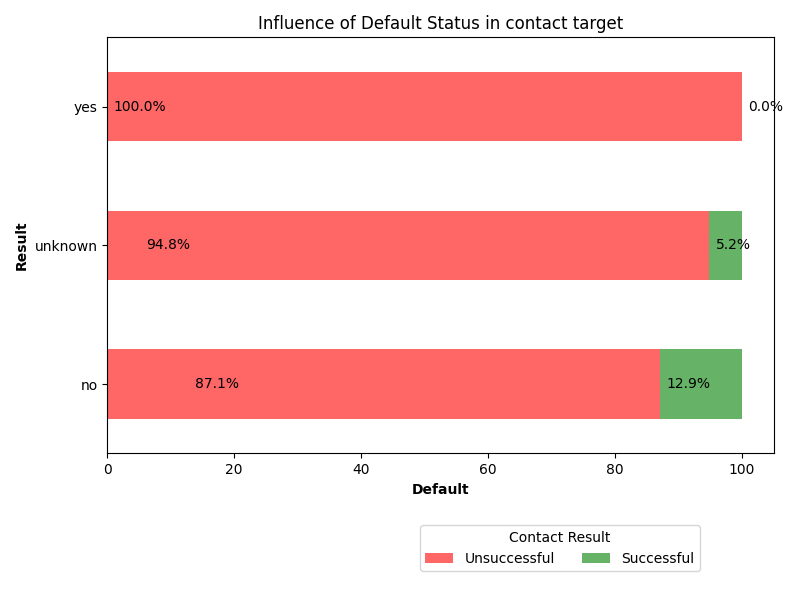
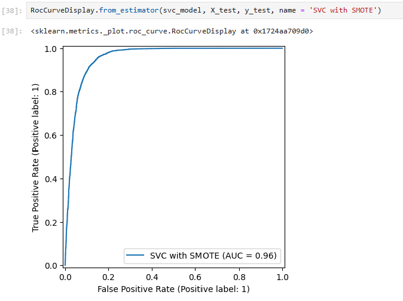

# Practical Application III 

## Comparing Classifiers with real-world data  

The business goal is to find a model that can improve the success of a contact, i.e., if the client subscribes to the deposit after a direct contact is made via a telephone call.

An efficient model can increase campaign efficiency by identifying the main characteristics that affect success, 
helping in a better management of the available resources (e.g., human effort, phone calls, time) and 
selection of a high-quality and affordable set of potential buying customers.

Our dataset comes from the [UCI Machine Learning repository](https://archive.ics.uci.edu/ml/datasets/bank+marketing).  
The data is from a Portuguese banking institution and is a collection of the results of multiple marketing campaigns.  
We will make use of the [article](CRISP-DM-BANK.pdf) accompanying the dataset for more information on the data and features.

**A complete answer to each problem posed for this Application is provided in the attached [Notebook](Deposit_Subscription.ipynb).**
However, in this README, we will illustrate some key steps of the model development and the results and findings. 

### Problem 1 Answer. 
The dataset collected is related to 17 campaigns between May 2008 and November 2010, corresponding to 79354 contacts.

### Features and Target

**Input variables:**

1. *age* (numeric)
2. *job* : type of job (categorical: 'admin.','blue-collar','entrepreneur','housemaid','management','retired','self-employed','services','student','technician','unemployed','unknown')
3. *marital* : marital status (categorical: 'divorced','married','single','unknown'; note: 'divorced' means divorced or widowed)
4. *education* (categorical: 'basic.4y','basic.6y','basic.9y','high.school','illiterate','professional.course','university.degree','unknown')
5. *default* : has credit in default? (categorical: 'no','yes','unknown')
6. *housing* : has housing loan? (categorical: 'no','yes','unknown')
7. *loan* : has personal loan? (categorical: 'no','yes','unknown') # related with the last contact of the current campaign:
8. *contact* : contact communication type (categorical: 'cellular','telephone')
9. *month* : last contact month of year (categorical: 'jan', 'feb', 'mar', ..., 'nov', 'dec')
10. *day_of_week* : last contact day of the week (categorical: 'mon','tue','wed','thu','fri')
11. *duration* : last contact duration, in seconds (numeric). **Note:** this attribute highly affects the output target (e.g., if duration=0 then y='no'). 
12. *campaign* : number of contacts performed during this campaign and for this client (numeric, includes last contact)
13. *pdays* : number of days that passed by after the client was last contacted from a previous campaign (numeric; 999 means client was not previously contacted)
14. *previous* : number of contacts performed before this campaign and for this client (numeric)
15.  *poutcome* : outcome of the previous marketing campaign (categorical: 'failure','nonexistent','success')
**Social and economic context attributes**
16. *emp.var.rate* : employment variation rate - quarterly indicator (numeric)
17. *cons.price.idx* : consumer price index - monthly indicator (numeric)
18. *cons.conf.idx* : consumer confidence index - monthly indicator (numeric)
19. *euribor3m* : euribor 3 month rate - daily indicator (numeric)
20. *nr.employed* : number of employees - quarterly indicator (numeric)

#### Output variable (desired target):
**y** - has the client subscribed a term deposit? (binary: 'yes','no')

```python
df.head(5).to_markdown()
|    |   age | job       | marital   | education   | default   | housing   | loan   | contact   | month   | day_of_week   |   duration |   campaign |   pdays |   previous | poutcome    |   emp.var.rate |   cons.price.idx |   cons.conf.idx |   euribor3m |   nr.employed | y   |
|---:|------:|:----------|:----------|:------------|:----------|:----------|:-------|:----------|:--------|:--------------|-----------:|-----------:|--------:|-----------:|:------------|---------------:|-----------------:|----------------:|------------:|--------------:|:----|
|  0 |    56 | housemaid | married   | basic.4y    | no        | no        | no     | telephone | may     | mon           |        261 |          1 |     999 |          0 | nonexistent |            1.1 |           93.994 |           -36.4 |       4.857 |          5191 | no  |
|  1 |    57 | services  | married   | high.school | unknown   | no        | no     | telephone | may     | mon           |        149 |          1 |     999 |          0 | nonexistent |            1.1 |           93.994 |           -36.4 |       4.857 |          5191 | no  |
|  2 |    37 | services  | married   | high.school | no        | yes       | no     | telephone | may     | mon           |        226 |          1 |     999 |          0 | nonexistent |            1.1 |           93.994 |           -36.4 |       4.857 |          5191 | no  |
|  3 |    40 | admin.    | married   | basic.6y    | no        | no        | no     | telephone | may     | mon           |        151 |          1 |     999 |          0 | nonexistent |            1.1 |           93.994 |           -36.4 |       4.857 |          5191 | no  |
|  4 |    56 | services  | married   | high.school | no        | no        | yes    | telephone | may     | mon           |        307 |          1 |     999 |          0 | nonexistent |            1.1 |           93.994 |           -36.4 |       4.857 |          5191 | no  |
```

### Problem 4 Answer:

### Business Objective

Our primary business objective is to enhance the efficiency of directed marketing campaigns aimed at increasing long-term deposit subscriptions. 
This involves using data mining techniques to reduce the number of contacts required while maintaining a similar number of successful subscriptions. 
We want to identify the most promising leads to target, optimize resource allocation, and improve campaign effectiveness.

### Feature Engineering and Encoding

Using just the bank information features, prepare the features and target column for modeling with appropriate encoding and transformations.



### Create X, y - Independent and Target Variables

```python
X = df.drop(columns = ['y'], axis = 1)

# Create the target variable of type Boolean based on 'yes' 'no' values in the dataset.
y = df['y'].map({'yes': 1, 'no': 0})
```

### A Baseline Model

Before we build our first model, we want to establish a baseline.

The AUC plots the False Positive Rate (FPR) versus the True Positive Rate (TPR) and allows identifying how good is the class discrimination: the higher the better, with the ideal model having a value of 1.0.
A random baseline classifier produces a 0.5 Area under Curve (AUC), and the **ideal** AUC value is 1.0.
We should attempt to beat this metric in all our models and strive to reach the ideal.

```python
dummy_cls = DummyClassifier(strategy='uniform')
dummy_cls.fit(X_train, y_train)
```



### A Simple Model

- We will first define the columns for pre-processing.

```python
# Define numerical and categorical columns
numerical_cols = X.select_dtypes(include=['int64', 'float64']).columns.tolist()
categorical_cols = X.select_dtypes(include=['object']).columns.tolist()
```

- Then we build a column transformer to scale the numerical data and encode the categorical data using OneHotEncoding.

```python
# Create a ColumnTransformer for scaling and encoding
preprocessor = ColumnTransformer(
    transformers=[
        ('num', StandardScaler(), numerical_cols),
        ('cat', OneHotEncoder(drop='first', handle_unknown='ignore'), categorical_cols),
    ]
)
```

- Next, we will build a pipeline to perform the preprocessing and classifying steps. 


```python
simple_cls = LogisticRegression()
simple_pipeline = Pipeline(
    steps=[
        ('preprocessor', preprocessor),
        ('classifier', simple_cls),
    ]
)
```

- Finally we will fit our data into this pipeline.  

```python
simple_pipeline.fit(X_train, y_train)
```

### Scoring the simple model

We will now examine the accuracy of our model using appropriate metrics. 

- Since this is a classification problem, the Confusion Matrix will show us the classes and the true v/s predicted labels


We will now see the AUC metric scores for this simple model. 


It has improved somewhat from the baseline model, getting the AUC from 0.50 to 0.71, which is progress.

###  Model Comparisons 

Now, we aim to compare the performance of the Logistic Regression model to the KNN algorithm, Decision Tree, and SVM models.  
Using the default settings for each model, we will fit and score each. Also, the fit time of each of the models should be compared.

We show a snippet of code that is used to create the models, get the results, and fit the time. The Notebook contains more details about the functions that loop through and calculate the accuracy results using the ROC_AUC metric. 

```python
models = {
    'Logistic Regression': LogisticRegression(),
    'KNN': KNeighborsClassifier(),
    'Decision Tree': DecisionTreeClassifier(),
    'SVM': SVC()
}

# DataFrame to store results
models_results = pd.DataFrame(columns=['Train Time', 'Training Results', 'Testing Results'])

# Loop through models
for model_name, model in models.items():
    train_time, train_result, test_result = fit_and_evaluate_pipeline(model, X_train, y_train, X_test, y_test)
    
    # Store results in DataFrame
    models_results.loc[model_name] = [train_time, train_result, test_result]
```

Next we see the results from running each model as shown above. 

```python
# Display the results
models_results.to_markdown()
|                     |   Train Time |   Training Results |   Testing Results |
|:--------------------|-------------:|-------------------:|------------------:|
| Logistic Regression |         0.21 |               0.69 |              0.71 |
| KNN                 |         0.1  |               0.77 |              0.70 |
| Decision Tree       |         0.38 |               1.00 |              0.75 |
| SVM                 |        15.71 |               0.72 |              0.70 |
```

**Observations** 

1. It looks like the **Decision Tree** model, while overfitted (training Result = 100%), seems to perform best for the test set.
2. **SVC** had the largest fit-time as expected. All other models' training time was insignificant as being less than 1 second.
3. **KNN**, **LogReg** and **SVM** have the the same performance so far.

### Problem 11: Improving the Model

- The topic of feature engineering and gender selection was dealt with in the Paper, so we will proceed to other ways to improve the performance.
- We will do Hyperparameter tuning using GridSearchCV.
- Further, we will evaluate performance using ROC AUC more extensively.
- Finally, we will also use SMOTE to oversample the under-represented class.

### `GridSearchCV` 

1. First, we create some helper functions to tune for the best hyperparameters in each model
2. Next, we create a dictionary of the hyperparameters for each type of classifier.
3. Then, we run this GridSearch using the smaller dataset provided.
4. Next, we see the results that get us the best tuning parameter.
5. Finally, we use these hyperparameters and re-run the model using the entire dataset and evaluate the improvements.

In this report, we will only briefly show the code; please refer to the Notebook for all class definitions and functions, and more charts.

```python
    # Create the GridSearchCV object
    grid_search = GridSearchCV(
        pipeline, 
        param_grid, 
        scoring='precision', 
        cv=5,
        verbose=3,
    )
    
    # Fit the grid search to the training data
    grid_search.fit(X_train, y_train)

...
...

# Evaluate different classifiers
evaluate_classifier(KNeighborsClassifier(), knn_param_grid, preprocessor, X_train, y_train, X_test, y_test, tuning_results)
evaluate_classifier(DecisionTreeClassifier(), decision_tree_param_grid, preprocessor, X_train, y_train, X_test, y_test, tuning_results)
evaluate_classifier(LogisticRegression(), logistic_regression_param_grid, preprocessor, X_train, y_train, X_test, y_test, tuning_results)
evaluate_classifier(SVC(), svc_param_grid, preprocessor, X_train, y_train, X_test, y_test, tuning_results)
```



**Summary of Tuning**


- We see that **LogReg** and **SVC** models have the best test results after GridSearch based on the precision scores.
- We have seen precision scores here and tuned for that.
- We will next explore the ROC AUC metric, by rerunning the model and training it using the best parameters obtained in the GridSearch.

We will apply the SVC model again using the best parameters found from the tuned model, and get the AUC metric to compare with what the Paper has published. 

```python
tuning_results_df.loc['SVC']['Best Parameters']
{'classifier__C': 1, 'classifier__gamma': 'auto', 'classifier__kernel': 'rbf'}

best_params = tuning_results_df.loc['SVC']['Best Parameters']
svc_model = SVC(
    kernel = best_params['classifier__kernel'],
    C = best_params['classifier__C'],
    gamma = best_params['classifier__gamma'],
)
prod_pipeline = Pipeline(
    steps=[
        ('preprocessor', preprocessor),
        ('classifier', svc_model),
    ]
)
prod_pipeline.fit(X_train, y_train)
```



Notice the metric obtained by the paper authors using SVM - **we were able to match it with this exercise.** 



#### Other findings

1. Credit default feature
   


Those who are not in default (Result = 'no') seem to mirror the distribution of the whole dataset, while those whose credit status is 'Unknown' are less than half as likely to be successful in landing deposit after contact. This information can possibly be used in further tuning. 

#### Other tuning methods

Since we are dealing with an imbalanced class we can use methods to oversample and ensure that the classes have equal representation by using oversampling methods such as
[SMOTE](https://imbalanced-learn.org/stable/references/generated/imblearn.over_sampling.SMOTE.html). 

The [notebook](Imbalance_SMOTE.ipynb) - has implemented this tuning and we see the results with the graph below which is even better than what we saw with SVC tuned but same dataset. 


